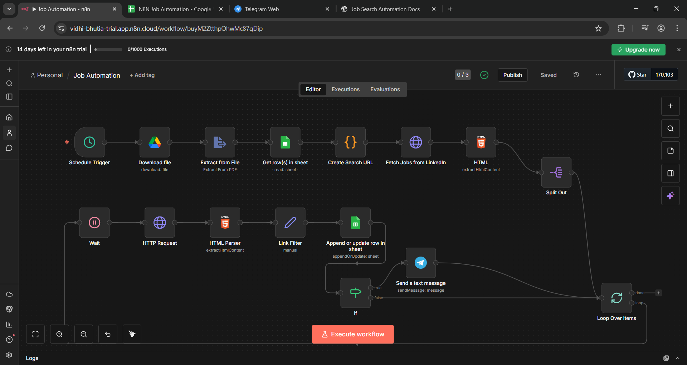
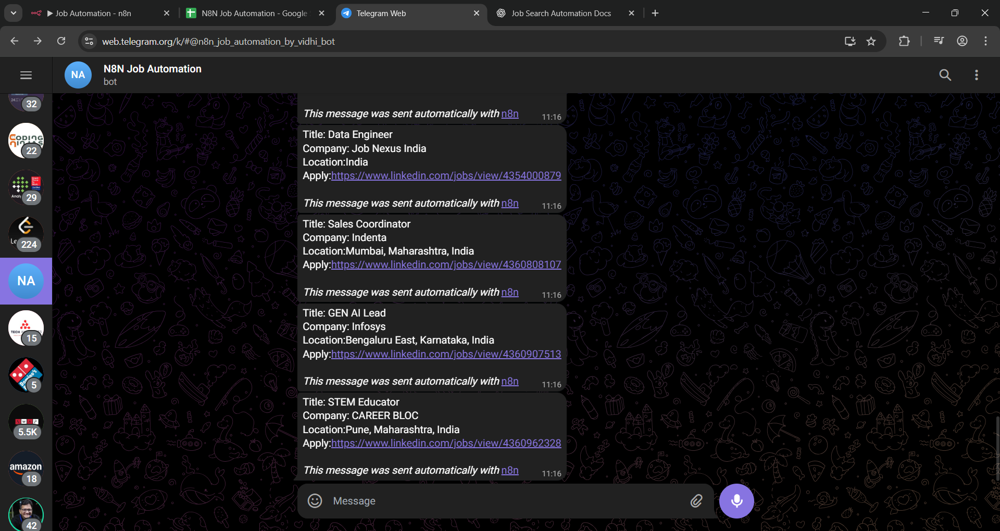

# N8N Job Search Automation

An end-to-end automation workflow built using **n8n** that periodically searches for relevant jobs on LinkedIn based on configurable preferences and sends real-time notifications to Telegram. The system also stores job results in Google Sheets for tracking and deduplication.

> ⚠️ **Disclaimer**: This project is built strictly for educational and demonstration purposes. It should **not** be used to scrape platforms in violation of their Terms of Service.

## Dashboard Preview



## Demo Output (Telegram Notification)



## Features

* Scheduled job search every 6 hours
* Dynamic job filtering using Google Sheets
* Resume parsing from Google Drive (PDF)
* Automated LinkedIn job search URL generation
* Rate-limited job page processing
* Structured job extraction and cleanup
* Google Sheets-based job storage and deduplication
* Instant Telegram notifications for valid jobs

## Prerequisites

Before you begin, ensure you have:

* An active **n8n instance** (local or cloud)
* A **Google account** (Drive + Sheets access)
* A **Telegram account**
* Your **resume in PDF format**

## Part 1: Setting Up the Foundation

### Step 1: Create a New Workflow in n8n

1. Log into your n8n instance
2. Click **Create new workflow**
3. Name it: **Job Automation**
4. Save the workflow

### Step 2: Add the Schedule Trigger

This triggers the workflow every 6 hours.

* Add node → **Schedule Trigger**
* Configuration:

  * Mode: `Interval`
  * Interval: `Hours`
  * Days Between Triggers: `6`
* Execute the node to test

## Part 2: Resume Storage Setup

### Step 3: Upload Resume to Google Drive

1. Upload your resume (PDF) to Google Drive
2. Right-click → **Copy link**
3. Copy the File ID from the URL:

```
https://drive.google.com/file/d/FILE_ID/view
```

### Step 4: Configure Google Drive Credentials

* Go to **Credentials** → **Add Credential**
* Select **Google Drive OAuth2 API**
* Connect and authorize
* Name it: `Google Drive account`

### Step 5: Add "Download File" Node

* Node: **Google Drive**
* Operation: `Download`
* File ID: Use Expression and paste the sharing URL
* Execute to confirm file download
  
### Step 6: Extract Resume Text

* Add **Extract from File** node
* Operation: `PDF`
* Binary Property: `data`
* Execute and verify extracted resume text

## Part 3: Job Search Preferences with Google Sheets

### Step 7: Create Google Sheets Database

Create a new spreadsheet with two sheets:

#### Sheet 1: `Filter`

| Keyword  | Location | Experience Level              | Remote         | Job Type  | Easy Apply |
| -------- | -------- | ----------------------------- | -------------- | --------- | ---------- |
| Python   | India    | Entry Level                   | Remote, Hybrid | Full-time | TRUE       |

#### Sheet 2: `Result`

| Title | Company | Location | Link | Description |
| ----- | ------- | -------- | ---- | ----------- |

Save the spreadsheet and keep the URL handy.

### Step 8: Configure Google Sheets Credentials

* Credentials → **Add Credential**
* Select **Google Sheets OAuth2 API**
* Authorize access
* Name it: `Google Sheets account`

### Step 9: Read Filter Preferences

* Node: **Google Sheets**
* Operation: `Get Many`
* Sheet: `Filter`
* Execute to verify preferences are fetched

## Part 4: Building the LinkedIn Search URL

### Step 10: Create Search URL (Code Node)

* Node: **Code**
* Mode: `Run Once for All Items`
* Purpose: Convert sheet preferences into a LinkedIn search URL

Execute the node to verify a valid LinkedIn job search URL is generated.

## Part 5: Fetching Jobs from LinkedIn

### Step 11: Fetch Job Search Page

* Node: **HTTP Request**
* Method: `GET`
* URL: `={{ $json.url }}`

### Step 12: Extract Job Links

* Node: **HTML Extract**
* CSS Selector:

  ```
  ul.jobs-search__results-list li div a[class*="base-card"]
  ```
* Attribute: `href`
* Return Array: Enabled

### Step 13: Split Job Links

* Node: **Split Out**
* Field: `links`
* Each job is now processed individually

## Part 6: Processing Jobs with Rate Limiting

### Step 14: Loop Over Items

* Node: **Loop Over Items**
* Batch Size: `1`

### Step 15: Wait Node

* Node: **Wait**
* Delay: `5 seconds` (you can adjust this accordingly)
* Prevents rate limiting

### Step 16: Fetch Individual Job Page

* Node: **HTTP Request**
* URL: `={{ $json.links }}`
* Retry on fail: Enabled
* Execute once: Disabled

## Part 7: Parsing Job Information

### Step 17: Parse Job Attributes

* Node: **HTML Extract**
* Extract:

  * Title
  * Company
  * Location
  * Description
  * Job ID

### Step 18: Modify Job Attributes

* Node: **Edit Fields (Set)**
* Cleans whitespace
* Extracts numeric Job ID
* Builds direct apply link

## Part 8: Store Results in Google Sheets

### Step 19: Append or Update Row

* Node: **Google Sheets**
* Operation: `Append or Update`
* Sheet: `Result`
* Matching Column: `link`

Prevents duplicate job entries.

## Part 9: Filter Valid Jobs

### Step 20: Link Filter

* Node: **IF**
* Condition: `link is not empty`
* True → Notify
* False → Skip

## Part 10: Telegram Notifications

### Step 21: Create Telegram Bot

* Use `@BotFather`
* Create bot and copy API token
* Retrieve Chat ID via `getUpdates` or visit `https://api.telegram.org/bot<YOUR_TOKEN>/getUpdates`

### Step 22: Configure Telegram Credentials

* Credential: **Telegram API**
* Paste Bot Token
* Name: `Telegram Bot`

### Step 23: Send Telegram Message

* Node: **Send a Text Message**
* Message includes:

  * Job Title
  * Company
  * Location
  * Apply Link
* Disable n8n attribution

## Part 11: Closing the Loop

### Step 24: Complete the Workflow Loop

* Connect Telegram success path back to **Loop Over Items**
* Connect filter-fail path back to **Loop Over Items**

This ensures all jobs are processed sequentially.

## Final Notes

This project demonstrates practical automation design, API integration, data parsing, and rate-limited workflows using n8n. It is intended for portfolio and recruiter showcase purposes.
